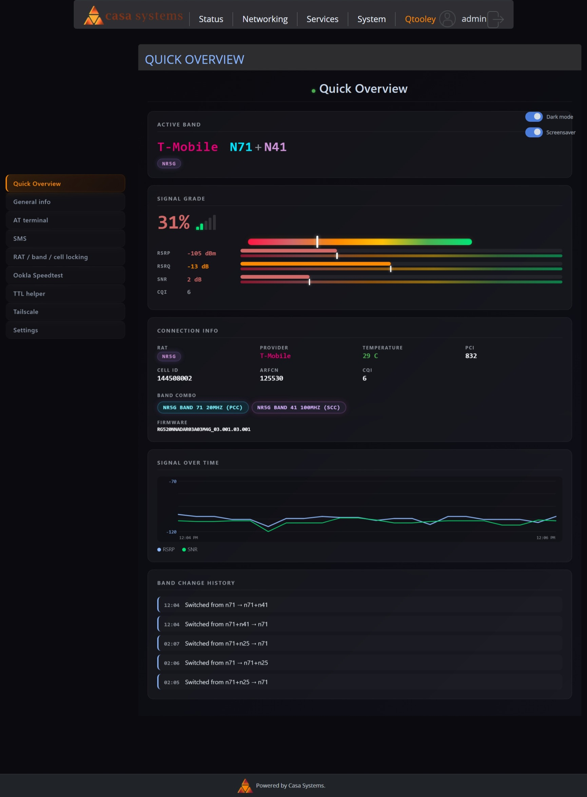
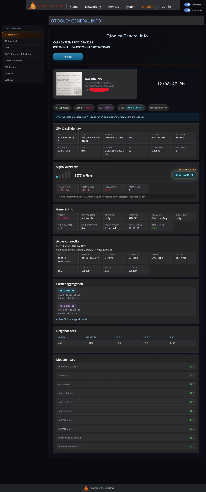
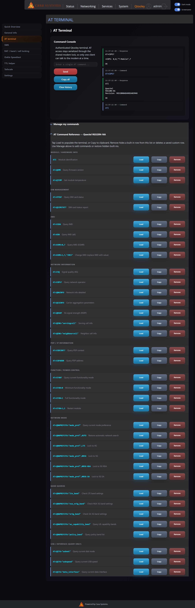
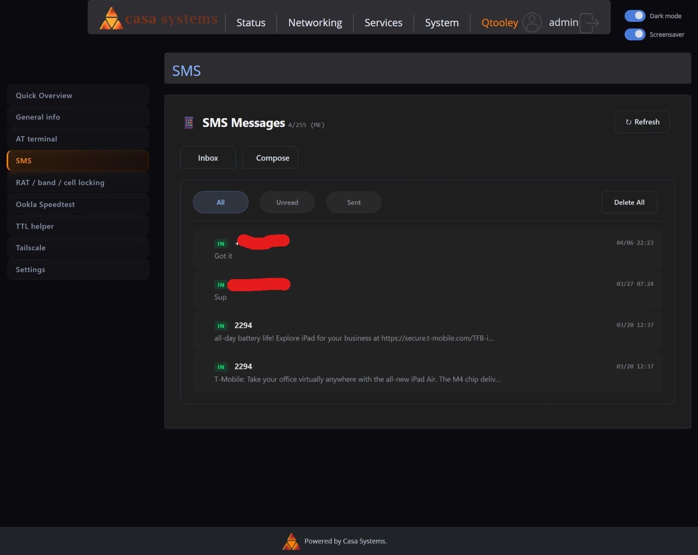
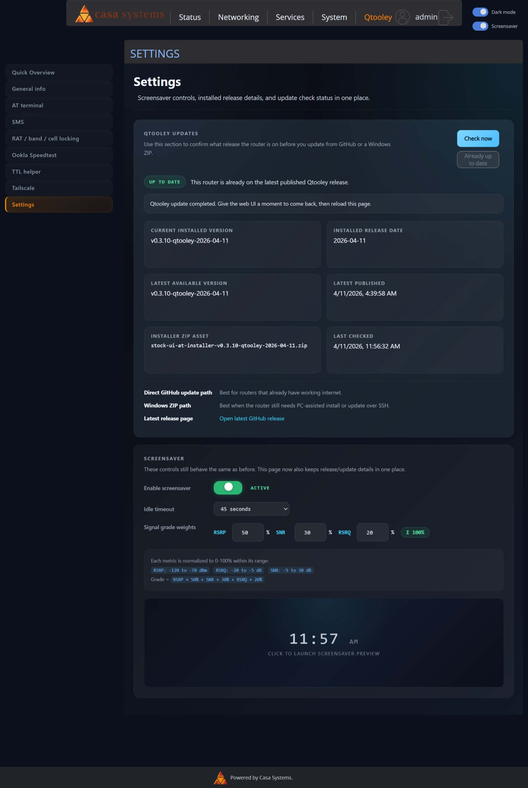
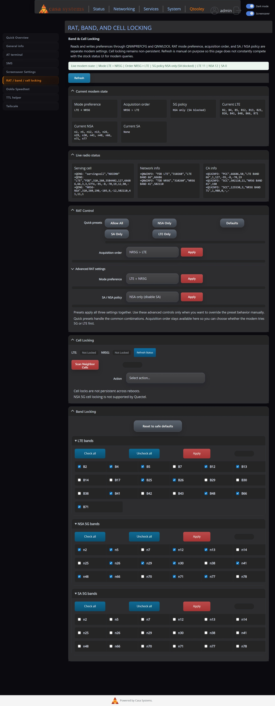
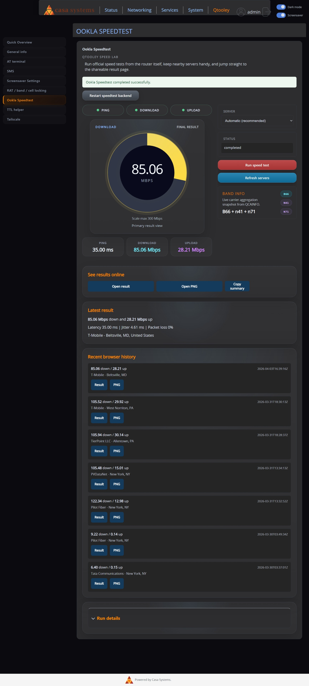
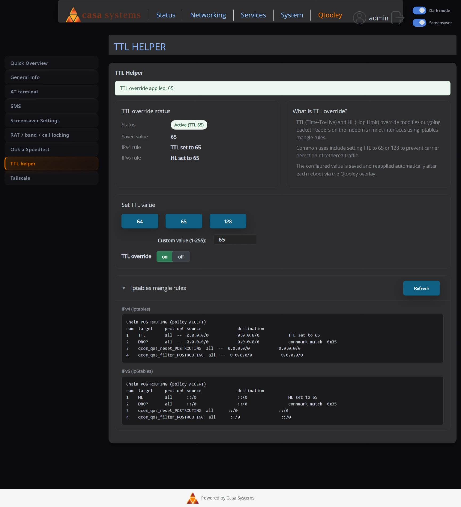
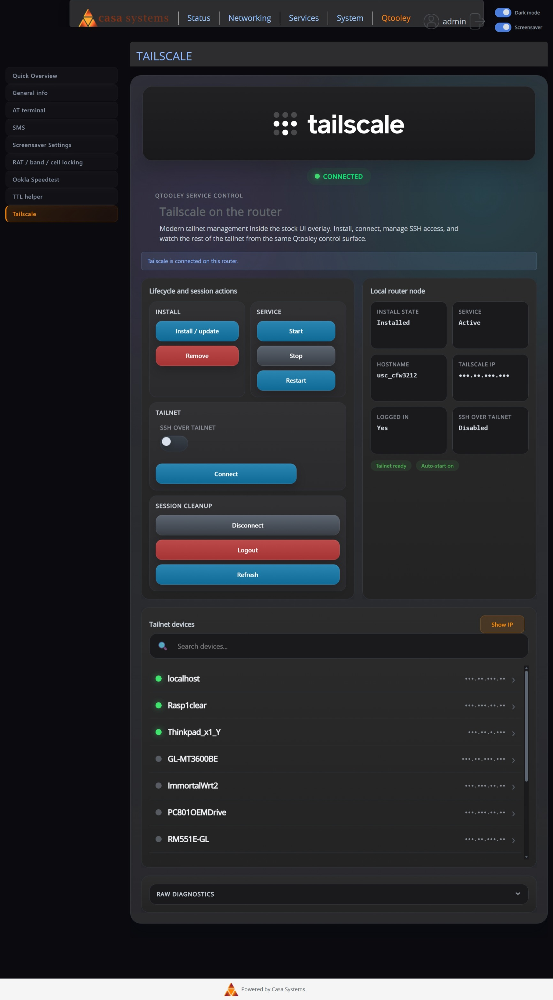

# CFW-3212 Qtooley Overlay

> Feature status: cell locking is still under development and is not working yet.

Qtooley is a stock UI overlay for the Casa Systems `CFW-3212` with a Quectel `RG520N-NA`.

It adds a top-level authenticated `Qtooley` tab inside the stock Casa Turbo web UI for modem visibility, control, and diagnostics.

This is not a generic web app and it is not a generic USB modem project.

## Start Here

- [Latest Release](https://github.com/Joetooley28/cfw3212-qtooley-overlay/releases/latest)
- [Release Install Guide](router-files/stock-ui-at/RELEASE_INSTALL.md)
- [Emergency Stock Web Recovery](docs/fallback-stock-recovery.md)

## What You Get

- Quick Overview
- General Info
- AT terminal
- Settings page with screensaver controls and release/update status
- RAT / band / cell locking
- Ookla Speedtest
- TTL helper
- optional Tailscale UI after base install

Dark mode note:

- the shared dark mode toggle applies across themed stock UI pages and Qtooley pages

## Choose Your Install Path

Use the Windows release ZIP when:

- the router does not already have working internet
- you want the normal Windows-assisted install, update, or uninstall flow over SSH

Use the direct GitHub router command when:

- the router already has working internet
- you want to install, update, or uninstall from an SSH shell on the router itself

Direct GitHub install or update:

- `sh -c "$(wget -qO- https://raw.githubusercontent.com/Joetooley28/cfw3212-qtooley-overlay/main/router-files/stock-ui-at/usrdata/at-stock-ui/update_from_github_release.sh)"`

Direct GitHub uninstall:

- `sh -c "$(wget -qO- https://raw.githubusercontent.com/Joetooley28/cfw3212-qtooley-overlay/main/router-files/stock-ui-at/usrdata/at-stock-ui/uninstall_from_github_release.sh)"`

## Before You Install

- the router must already be rooted
- SSH must already be enabled and reachable
- the normal public release asset is the Windows ZIP
- bundled Ookla is expected in public release ZIPs
- Tailscale is optional and is installed later from the Qtooley UI

## Known Limits

- cell locking is still under development and is not working yet
- root access is required
- SSH access is required
- Tailscale is optional and not part of the base install

## Device Scope

Tested and documented target:

- router: Casa Systems `CFW-3212`
- modem: Quectel `RG520N-NA`
- tested router firmware: `USC_1.1.79.0`
- tested module firmware seen in notes: `RG520NNADAR03A03M4G`

Important platform truths:

- `/usrdata` is the writable persistent area
- the proven AT backend path is `/dev/smd7`
- the shared AT lock path is `/tmp/at-http.lock`
- the proven persistence model is the stock UI overlay under `/usrdata/at-stock-ui`

## Platform Notes

The overlay is built around the real behavior of this router:

- preserve LAN access
- preserve the stock login page and stock UI shell
- preserve SSH reachability
- keep the proven `/usrdata/at-stock-ui` overlay model
- avoid redesigning the project around generic USB modem assumptions

Current proven overlay model:

- keep payload under `/usrdata/at-stock-ui`
- build live trees under `/usrdata/at-stock-ui/live`
- bind-mount `live/www` onto `/www`
- bind-mount `live/usr/share/lua/5.1/webif` onto `/usr/share/lua/5.1/webif`
- restart `turbontc.service`
- reapply late after boot with `jtools-stock-ui.service` and `jtools-stock-ui.timer`

Verification note:

- plain `mount` output is misleading on this device
- use `/proc/self/mountinfo`

## Project Tracks

There are three branch roles in the current project layout:

- `main`: public-facing release and docs branch
- `working-branch`: active source and development branch
- `standalone-at-terminal-old`: legacy older branch

If you are new to the project, use `main`.

## Screenshots

### General Info

### AT Terminal

### SMS

### Settings

### RAT / Band / Cell Locking

### Ookla Speedtest

### TTL Helper

### Tailscale

## More Docs

- [Release Install Guide](router-files/stock-ui-at/RELEASE_INSTALL.md)
- [Emergency Stock Web Recovery](docs/fallback-stock-recovery.md)
- [Platform Notes](docs/platform-notes.md)
