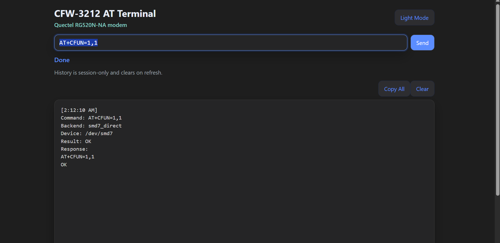

# CFW-3212 AT Terminal v0.1.0

Standalone AT terminal for the Casa Systems CFW-3212 / Quectel RG520N-NA.

Use at your own risk. This project is meant for people who are comfortable working on rooted carrier hardware and understand that modem settings can affect connectivity, access, and behavior. You are responsible for what you send through the terminal.



Additional documentation:

- [AT Terminal Notes](docs/at-terminal-notes.md)
- [General Notes](docs/general-notes.md)

## What This Is

This package installs a small standalone Lua AT terminal page and backend on the router.

It does **not**:
- modify Casa Turbo
- replace stock web services
- replace stock `port_bridge`
- expose the service on every interface

Current intended browser access:

- `http://192.168.1.1:8088/`

Important:

- in the current version, the AT terminal listens on the LAN bridge IP at `192.168.1.1:8088`
- there is no separate authentication layer in front of the terminal
- treat it as a trusted-LAN tool, not a hardened public-facing service

## How It Works

This is **not** a generic host-PC-to-USB-modem design.

On the CFW-3212, the modem/app processor is the platform itself. The backend talks to the modem using the platform-native device path directly.

Current default backend:

- `/dev/smd7`

The backend uses a direct one-shot transaction model against the `smd` device path rather than going through a typical USB serial AT port. That is why the config refers to `smd7_direct`.

Important:
- default backend remains `smd7_direct`
- `at_mdm0_direct` and `smd11_direct` are alternates only
- `at_usb2_direct` is not the main path and should remain experimental

## Files In This Package

Install under `/usrdata/at-http/`:

- `config.json`
- `at_backend.lua`
- `at_http.lua`
- `at_lock.lua`
- `at_validate.lua`
- `index.html`
- `app.js`
- `app.css`

Install outside that directory:

- `/usrdata/start-at-http.sh`
- `/etc/systemd/system/at-http-start.service`
- `/etc/systemd/system/at-http-start.timer`

## Router Prerequisites

- rooted Casa Systems CFW-3212
- Lua working on-box
- SSH access

Optional:
- ADB access

## Install

### 1. Copy app files

Copy these into:

- `/usrdata/at-http/`

### 2. Copy the autostart files

Copy:

- `start-at-http.sh` -> `/usrdata/start-at-http.sh`
- `at-http-start.service` -> `/etc/systemd/system/at-http-start.service`
- `at-http-start.timer` -> `/etc/systemd/system/at-http-start.timer`

### 3. Make the start script executable

```sh
chmod +x /usrdata/start-at-http.sh
```

### 4. Reload systemd and enable the timer

```sh
systemctl daemon-reload
systemctl enable --now at-http-start.timer
```

## Manual Start / Stop

Manual start:

```sh
cd /usrdata/at-http
lua /usrdata/at-http/at_http.lua /usrdata/at-http/config.json
```

Manual stop:

```sh
ps | grep '[l]ua /usrdata/at-http/at_http.lua'
kill <PID>
rm -f /tmp/at-http.lock
```

## What The Timer Does

The timer fires about 2 minutes after boot and runs:

- `/usrdata/start-at-http.sh`

The script:
- checks whether the AT terminal is already running
- starts it if not
- exits cleanly if it is already running

## Verify

Check the listener:

```sh
netstat -tulpn 2>/dev/null | grep 8088
```

Expected:

- `192.168.1.1:8088`

Check the timer/service:

```sh
systemctl status at-http-start.timer 2>/dev/null | sed -n '1,20p'
systemctl status at-http-start.service 2>/dev/null | sed -n '1,20p'
```

Open in browser:

- `http://192.168.1.1:8088/`

## Validator Policy

The validator enforces one command at a time and blocks multiline / shell-junk input, but it does not maintain an explicit AT command denylist in the current release.

## Rollback

Disable timer:

```sh
systemctl disable --now at-http-start.timer
```

Kill the running AT terminal if needed:

```sh
ps | grep '[l]ua /usrdata/at-http/at_http.lua'
kill <PID>
rm -f /tmp/at-http.lock
```

Remove files if desired:

- `/usrdata/at-http/*`
- `/usrdata/start-at-http.sh`
- `/etc/systemd/system/at-http-start.service`
- `/etc/systemd/system/at-http-start.timer`

## Version

- `v0.1.0`
